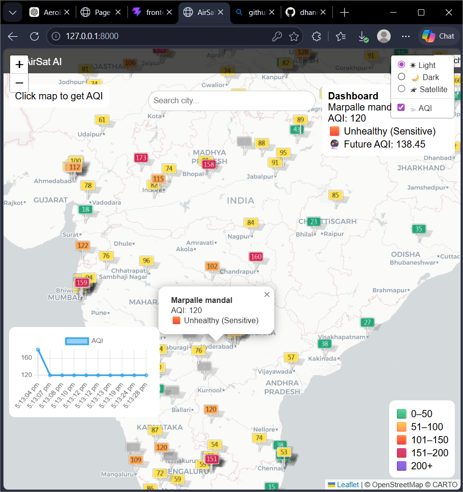
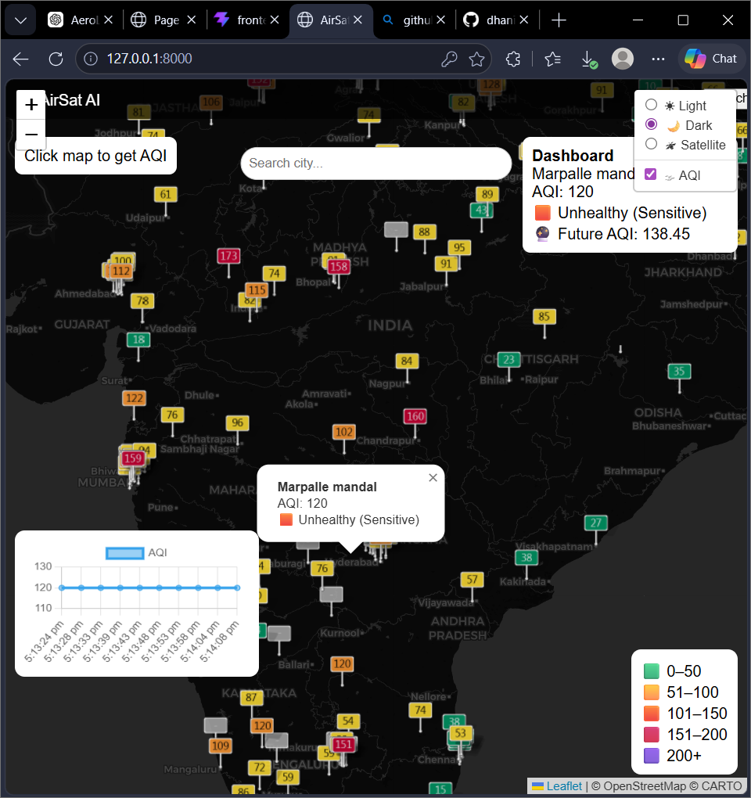
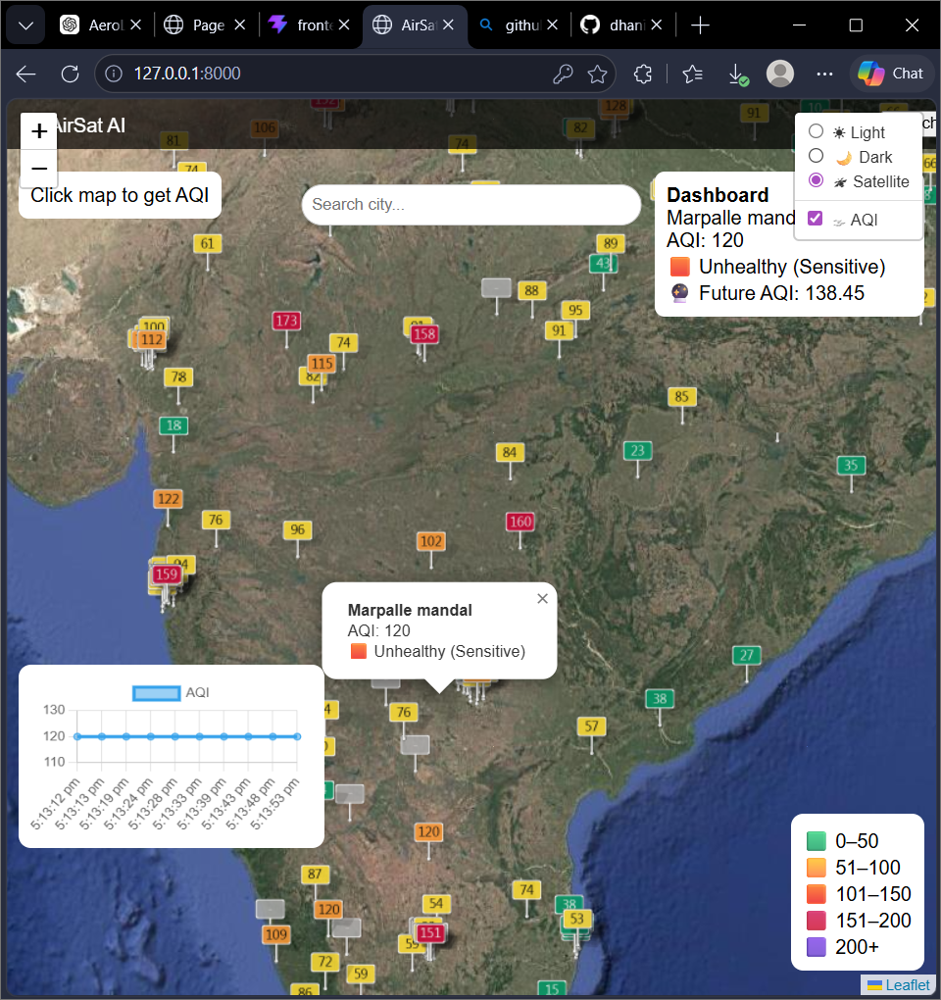
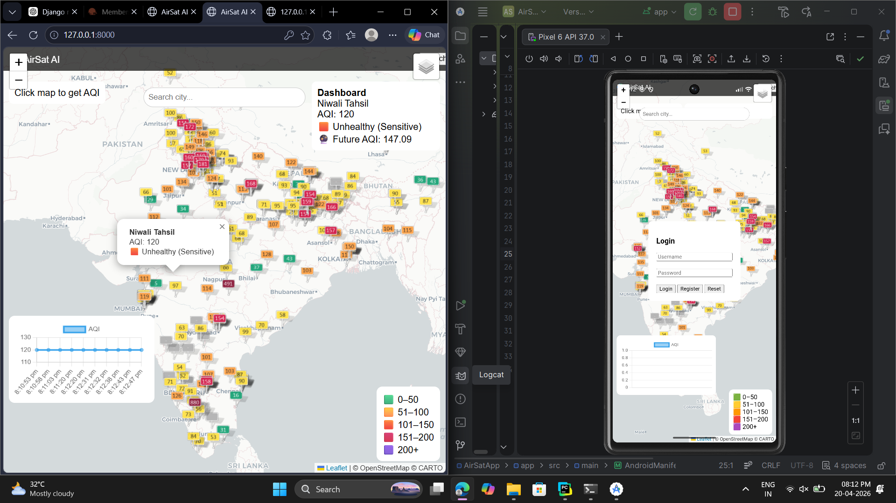
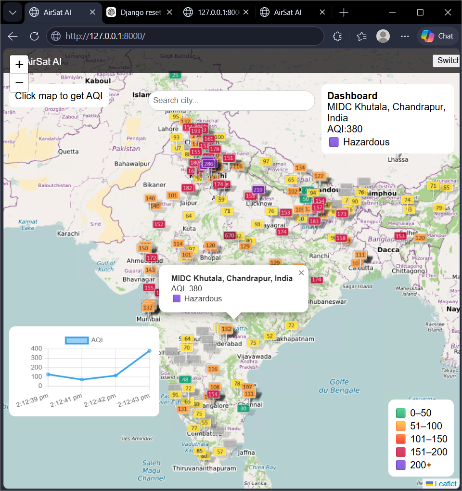

# 🌍 AeroLytix-AI

AI-powered real-time Air Quality Analytics and Prediction Platform.

## 🚀 Features

- Real-time AQI Monitoring
- Interactive India Map Visualization
- Future AQI Prediction
- Light / Dark / Satellite Modes
- Dynamic Dashboard
- AQI Trend Graphs
- Responsive UI
- Pollution Data Analytics
- Smart Visualization System

---

## 🛠 Tech Stack

### Frontend
- HTML
- CSS
- JavaScript
- Leaflet.js

### Backend
- Django
- Python

### Data & AI
- Pandas
- NumPy
- Machine Learning

---

## 📊 Screenshots

### ☀ Light Mode



---

### 🌙 Dark Mode



---

### 🛰 Satellite Mode



---

### 📱 Mobile View



---

## 📈 Prediction Dashboard



---

## 🎯 Project Objective

AeroLytix-AI was developed to provide intelligent environmental monitoring and AQI prediction through interactive visualization and AI-based analytics.

---

## 💡 Future Enhancements

- Android Application
- iOS Application
- Desktop Application
- Real-time Weather APIs
- Cloud Deployment
- Advanced AI Prediction Models
- User Authentication

---

## ▶ Run Locally

```bash
cd django_backend
python manage.py runserver
http://127.0.0.1:8000

👩‍💻 Developer

Dhaneswari Behera

GitHub:
https://github.com/dhaniu47
